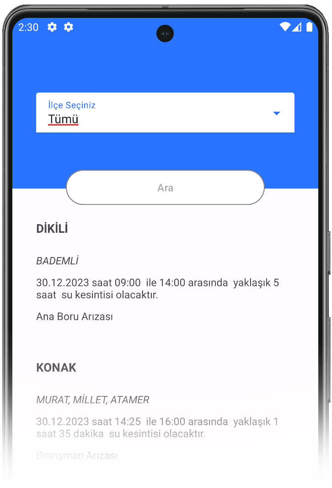

  

  <h3 align="center">İzmir Su Kesinti Takip</h3>

İzmir su kesinti takip uygulaması, İzmir Büyükşehir Belediyesinin Açık Veri Portalından yararlanarak geliştirilen, su kesintisi olduğunda yer ve zamanın bilgisini veren uygulamadır.
     

 

    

  <a href="https://github.com/rabiakambur/izmir-su-kesinti-takip/raw/master/app-debug.apk">APK İndir</a>

## Proje Hakkında

#### Motivasyon
Bu projeyi geliştirmemdeki ana sebep, proje üzerinden öğrendiklerimi pekiştirmek ve eksikliklerimi fark etmek. İzmir’de yaşayan biri olarak su kesintilerinin zaman zaman sms yoluyla bildirilmemesi böyle bir uygulama ihtiyacı hissettirdi. İzmir belediyesinin paylaştığı açık kaynak veri portalını da kullanarak uygulamayı hayata geçirdim.

#### Uygulama Mimarisi
Uygulamayı tamamen Kotlin dili ile geliştirdim. Amacım, ilk olarak geliştirdiğim uygulamayı kullanılabilir hale getirmekti. Bu nedenle, mümkün olduğunca temel düzeyde ilerledim. Ancak, ilerleyen zamanlarda öğreneceğim yeni mimarileri ve yapıları bu projede uygulamayı düşünüyorum.

#### Veri
Veri için [İzmir Büyükşehir Belediyesinin Açık Veri Portalındaki](https://acikveri.bizizmir.com/) İzsu'nun [Arıza Kaynaklı Düzensiz Su Kesintileri](https://acikveri.bizizmir.com/dataset/ariza-kaynakli-duzensiz-su-kesintileri/resource/adecfa0d-3f19-427f-bf40-25117921f938) web servisinden yararlanıldı.
